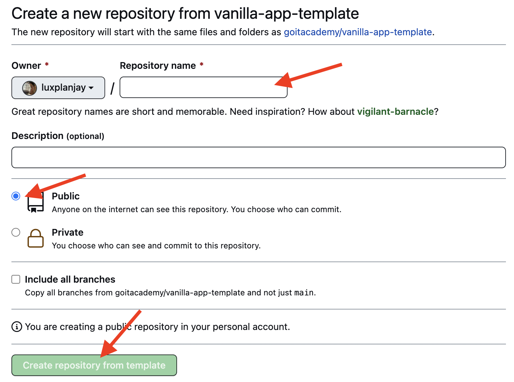

## Создание репозитория по шаблону

Используй этот репозиторий организации GoIT как шаблон для создания репозитория
своего проекта. Для этого нажми на кнопку `«Use this template»` и выбери опцию
`«Create a new repository»`, как показано на изображении.

На следующем шаге откроется страница создания нового репозитория. Заполни поле
его имени, убедись, что репозиторий публичный, после чего нажми кнопку
`«Create repository from template»`.

После того как репозиторий будет создан, необходимо перейти в настройки
созданного репозитория на вкладку `Settings` > `Actions` > `General` как
показано на изображении.

Проскролив страницу до самого конца, в секции `«Workflow permissions»` выбери
опцию `«Read and write permissions»` и поставь галочку в чекбоксе. Это
необходимо для автоматизации процесса деплоя проекта.

- **Желтый цвет** - выполняется сборка и деплой проекта.
- **Зеленый цвет** - деплой завершился успешно.
- **Красный цвет** - во время линтинга, сборки или деплоя произошла ошибка.

Более детальную информацию о статусе можно посмотреть кликнув по иконке, и в
выпадающем окне перейти по ссылке `Details`.

### Живая страница

Через какое-то время, обычно пару минут, живую страницу можно будет посмотреть
по адресу указанному на вкладке `Settings` > `Pages` в настройках репозитория.
Например, вот ссылка на живую версию для этого репозитория
[https://goitacademy.github.io/vanilla-app-template/](https://goitacademy.github.io/vanilla-app-template/).

Если открывается пустая страница, убедись что во вкладке `Console` нет ошибок
связанных с неправильными путями к CSS и JS файлам проекта (**404**). Скорее
всего у тебя неправильное значение флага `--base` для команды `build` в файле
`package.json`.

## Как это работает

1. После каждого пуша в ветку `main` GitHub-репозитория, запускается специальный
   скрипт (GitHub Action) из файла `.github/workflows/deploy.yml`.
2. Все файлы репозитория копируются на сервер, где проект инициализируется и
   проходит линтинг и сборку перед деплоем.
3. Если все шаги прошли успешно, собранная продакшн версия файлов проекта
   отправляется в ветку `gh-pages`. В противном случае, в логе выполнения
   скрипта будет указано в чем проблема.
